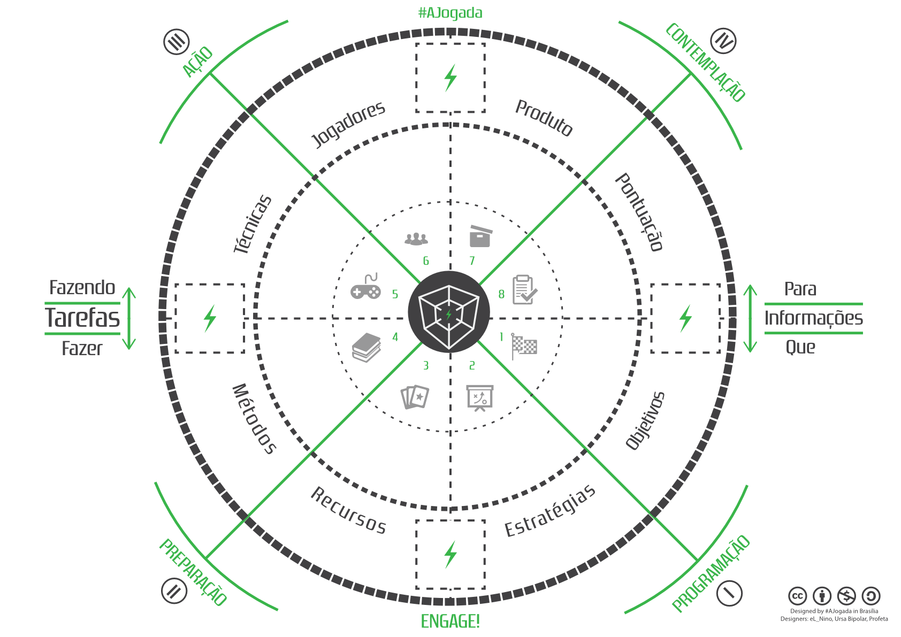

Tabuleiro A Jogada
=========

Aqui você encontra o Tabuleiro Oficial do projeto #ajogada baseado nos princípios da [Matriz Espelho](http://www.amazon.com.br/JOGADA-Sabedoria-Jogos-Jovens-Vision%C3%A1rios-ebook/dp/B00HV5M4UG/).

### Versão mais atual

O board atual está na versão 1.2 e pode ser baixado na aba [Releases](https://github.com/AJogada/the-board/releases).

### Como Usar

Para aprender a usar o Board assista este tutorial: https://www.youtube.com/watch?v=pfGFB2HGMPE

### Licenciamento

 O Tabuleiro de <a xmlns:cc="http://creativecommons.org/ns#" href="http://ajogada.com.br" property="cc:attributionName" rel="cc:attributionURL">Projeto A Jogada</a> está licenciado com uma Licença <a rel="license" href="http://creativecommons.org/licenses/by-nc-sa/4.0/">Creative Commons - Atribuição-NãoComercial-CompartilhaIgual 4.0 Internacional</a>. Baseado no trabalho disponível em <a xmlns:dct="http://purl.org/dc/terms/" href="https://github.com/AJogada/the-board" rel="dct:source">https://github.com/AJogada/the-board</a>.
